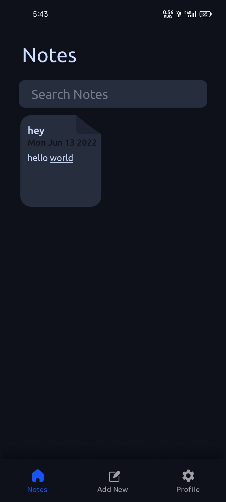
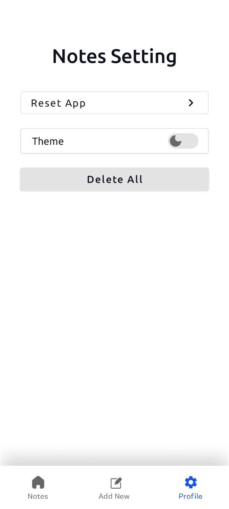
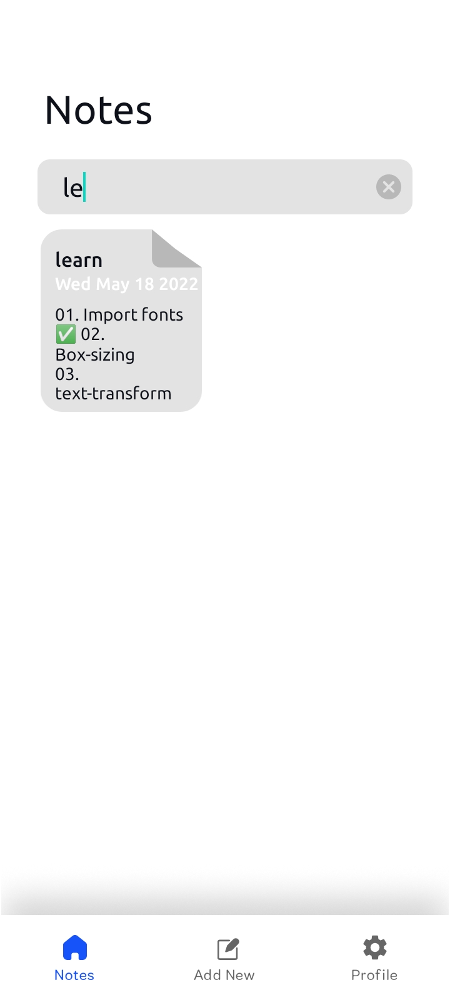
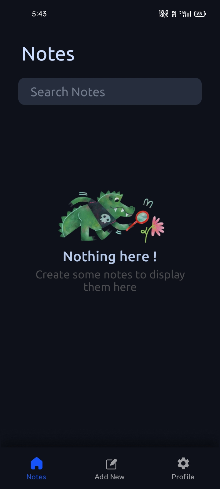
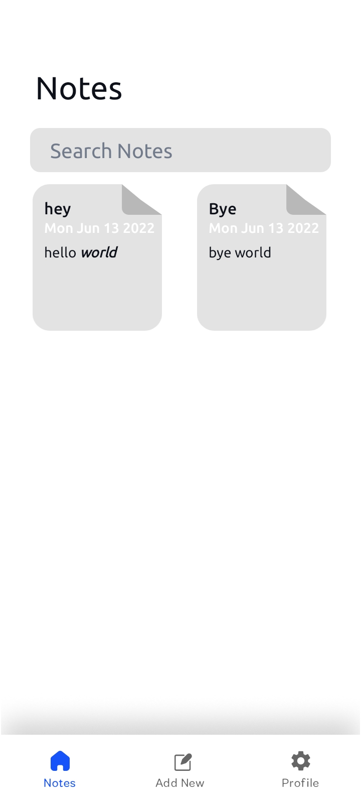

# Notes App 
 It's a very basic CRUD Notes app that uses ROOM/Sql Database to store data and with some custom dialogs and custom Note item states , Some preview from app are :
 
 
 
 
 
 
 
 
 
 
